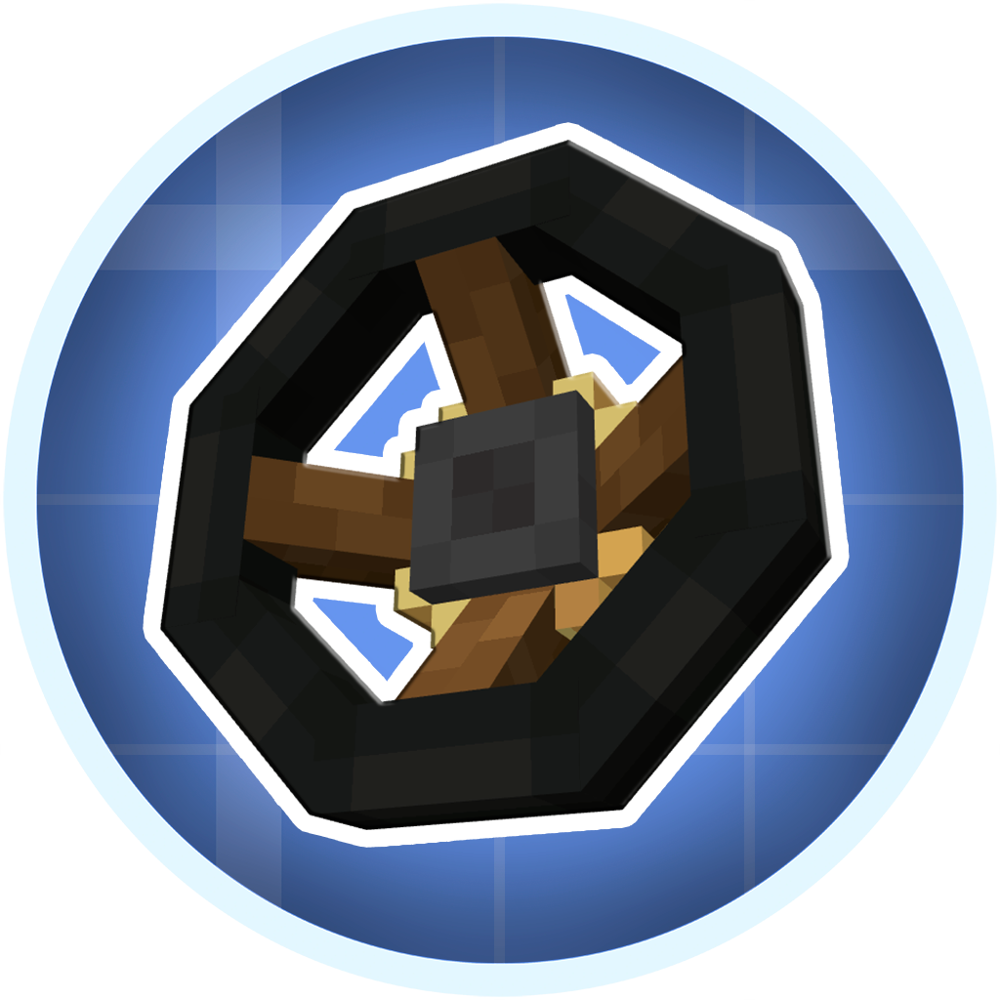

  

  <strong>Advanced mechanical vehicles and engineering systems for Create.</strong>

---

**Create: Mechanical Drive** is a NeoForge addon for **Minecraft 1.21.1** focused on advanced mechanical vehicles, power transmission, steering, suspension, drivetrains, and other engineering-oriented systems built on top of **Create**, **Sable**, and **Create: Aeronautics**.

The mod expands vehicle construction with a wide range of mechanical components intended for:

- Cars and trucks
- Tracked vehicles
- Tanks
- Utility machines
- Experimental contraptions
- Custom mechanical drivetrains and suspension systems

Rather than providing predefined vehicles, Create: Mechanical Drive is built around **modular engineering** — individual systems can be combined, configured, and integrated into custom mechanical builds.

---

## Community

Join the official **Create: Mechanical Drive** Discord server for development updates, bug reports, builds, technical discussion, and community support.

### [Join the Discord Server](https://discord.gg/sAHHxMYGnn)

---

## License

### Source Code

The source code of **Create: Mechanical Drive** is licensed under the **MIT License**.

This applies to the source code contained in this repository unless stated otherwise.

### Assets

All original assets bundled with Create: Mechanical Drive are protected by copyright.

This includes, but is not limited to:

- Custom block models
- Custom item models
- Textures
- Item and block artwork
- Other original visual assets included with the mod

These assets are **not licensed under the MIT License**.

They may not be reused, redistributed, modified, republished, or incorporated into other projects without permission from the respective copyright holder.

Some bundled assets and resource references originate from third-party projects and are subject to their own licenses, permissions, or usage terms.

For detailed attribution and information about third-party assets, see:

### [THIRD_PARTY_ASSETS.md](THIRD_PARTY_ASSETS.md)

---

## Disclaimer

**Create: Mechanical Drive** is an independent addon and is not an official part of **Create**, **Sable**, or **Create: Aeronautics**.
